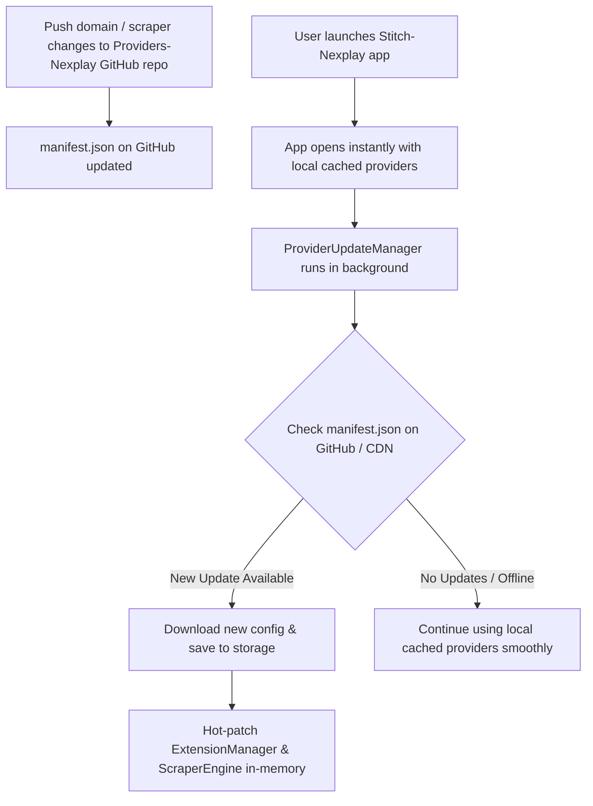

# NexPlay Scraper Engine & Dynamic OTA Providers Service

Standalone, high-speed multi-provider scraping, direct stream resolution engine, and **Over-The-Air (OTA) Dynamic Remote Provider Updater** for **NexPlay** and **Stitch-Nexplay**.

---

## 🚀 Providers Included

| Provider | Identifier | Domain | Focus & Content | Resolution Speed |
| :--- | :--- | :--- | :--- | :--- |
| **Server 1** | `hdhub4u` | `https://new5.hdhub4u.cl` | Indian Regional, Bollywood, Dual-Audio, 4K & 1080p Movies & Series | ~1.2s - 2.5s |
| **Server 2** | `4khdhub` | `https://4khdhub.one` | Hollywood, 4K HDR, Multi-Season TV Series, KDramas | ~0.8s - 2.0s |
| **Server 3** | `movies4u` | `https://movies4u.co` | Global Movies, TV Series, Fast Direct Mirrors | ~1.0s - 2.2s |

---

## 🔄 Dynamic Over-The-Air (OTA) Updates via GitHub

When domains change or scrapers are updated in this repository on GitHub (`https://github.com/ajith3211996-netizen/Providers-Nexplay`), the **Stitch-Nexplay** app automatically checks for and applies those updates every time a user opens the app—**without requiring an APK update or app store re-installation**!



### 📱 How to Integrate in `Stitch-Nexplay` (`App.js` / `index.js`)

In `Stitch-nexplay`, simply initialize dynamic updates on app launch:

```javascript
import React, { useEffect } from 'react';
import { ExtensionManager, ProviderUpdateManager } from './src/utils/ExtensionManager';

export default function App() {
  useEffect(() => {
    // 1. Initialize OTA updates in the background (Non-blocking: 0ms startup delay)
    ExtensionManager.initRemoteUpdates({
      autoCheck: true,
      checkIntervalMs: 1000 * 60 * 15 // Check every 15 minutes when app is opened
    });

    // 2. (Optional) Listen for update events in UI or settings
    const unsubscribe = ExtensionManager.onUpdate(({ event, data }) => {
      if (event === 'update-applied') {
        console.log(`[NexPlay] Scrapers dynamically updated to v${data.version}!`);
      }
    });

    return () => unsubscribe();
  }, []);

  return <YourMainAppNavigator />;
}
```

### ⚙️ Manual Update Check (e.g. Settings Screen)

```javascript
import { ExtensionManager } from './src/utils/ExtensionManager';

async function handleCheckForUpdates() {
  const result = await ExtensionManager.checkForUpdates(true); // force check
  if (result.status === 'updated') {
    alert(`Providers updated to version ${result.newVersion}!`);
  } else if (result.status === 'up-to-date') {
    alert('Providers are already up to date.');
  }
}
```

---

## 🛠️ How to Push Updates to GitHub

Whenever a provider changes its domain or scraper rules:

1. Update the domain or scraper logic in `manifest.json`, `ScraperEngine.js`, or `Movies4uProvider.js`.
2. Bump the version & build the manifest:
   ```bash
   npm run bump:patch     # e.g. 1.0.0 -> 1.0.1
   # OR
   npm run bump:minor     # e.g. 1.0.0 -> 1.1.0
   ```
3. Test locally:
   ```bash
   npm test
   ```
4. Commit and push to GitHub:
   ```bash
   git add .
   git commit -m "Update HDHub4u / 4KHDHub live domains"
   git push origin main
   ```
5. **Done!** Every user opening `Stitch-nexplay` will immediately receive and apply the new scrapers without an APK update!

---

## 📁 Directory Structure

```
Providers-Nexplay/
├── manifest.json              # Central remote configuration & live provider definitions
├── package.json               # Package manifests & scripts
├── index.mjs                  # Primary ES Module exports
├── runner.mjs                 # Interactive CLI stream probe & resolution tool
├── sync_to_app.ps1            # Auto-sync updated scrapers back to Stitch-nexplay
├── README.md                  # Complete documentation
├── scripts/
│   └── build_manifest.mjs     # CLI tool to build & bump version manifests
├── src/
│   ├── utils/
│   │   ├── ProviderUpdateManager.js # Dynamic OTA Update Engine (GitHub + CDN + Storage)
│   │   ├── ScraperEngine.js       # Core scraper (HDHub4u, 4KHDHub, HubCloud, GDFlix, DDrive, FastDL)
│   │   ├── Movies4uProvider.js    # Movies4u Provider & P.A.C.K.E.R. JS Unpacker
│   │   ├── ExtensionManager.js    # Strict server routing & media match orchestrator
│   │   ├── DnsResolver.js         # DNS-over-HTTPS (DoH) engine to bypass ISP blocks
│   │   ├── ProviderBundles.js     # Standalone scraper bundles for WebView execution
│   │   ├── api.js                 # TMDB Metadata API client
│   │   ├── permissions.js         # Permission helpers
│   │   └── responsive.js          # Layout calculation utilities
│   └── config/
│       └── tmdb.js                # TMDB API keys and endpoint configuration
└── tests/
    └── test_ota_update.mjs        # Verification suite for OTA updater & hot-patching
```

---

## ⚡ Quick Start

### 1. Install Dependencies
```bash
npm install
```

### 2. Run Comprehensive OTA & Resolver Tests
```bash
npm test
```

### 3. Resolve Streams via CLI
```bash
# Resolve a Movie across all servers:
node runner.mjs "Deadpool & Wolverine" --year 2024

# Resolve a specific TV Episode:
node runner.mjs "The Boys" --year 2019 --tv --season 4 --episode 1

# Query a specific server (1 = HDHub4u, 2 = 4KHDHub, 3 = Movies4u):
node runner.mjs "Stree 2" --year 2024 --server 1
```

### 4. Sync Updates Back to Main App (`Stitch-nexplay`)
Once tested, sync files directly back into `Stitch-nexplay` with:
```bash
npm run sync
```
